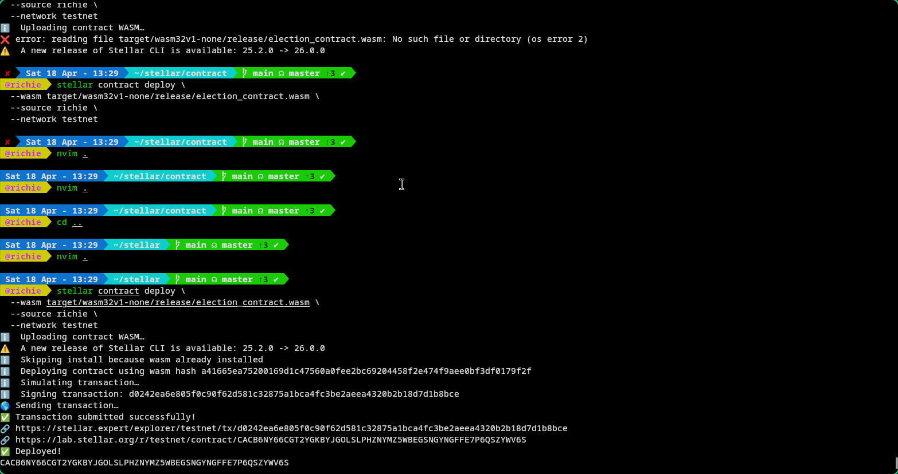
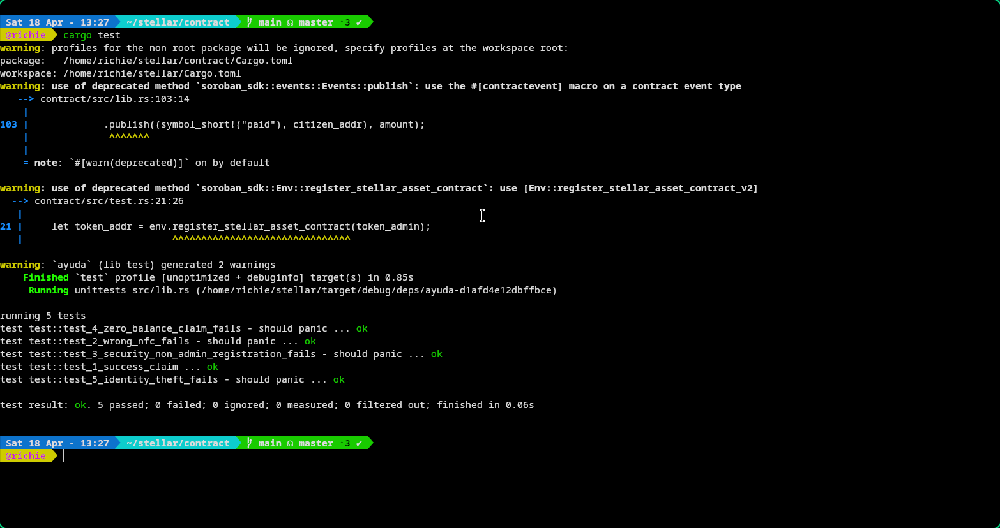
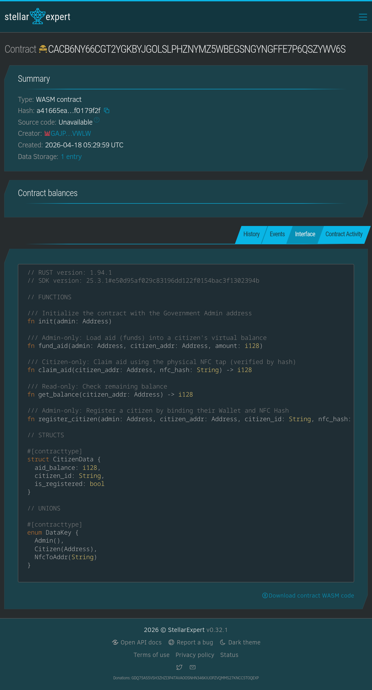
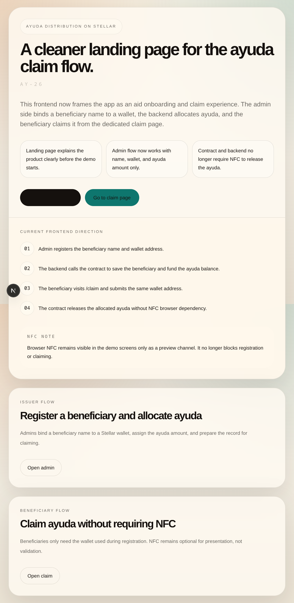
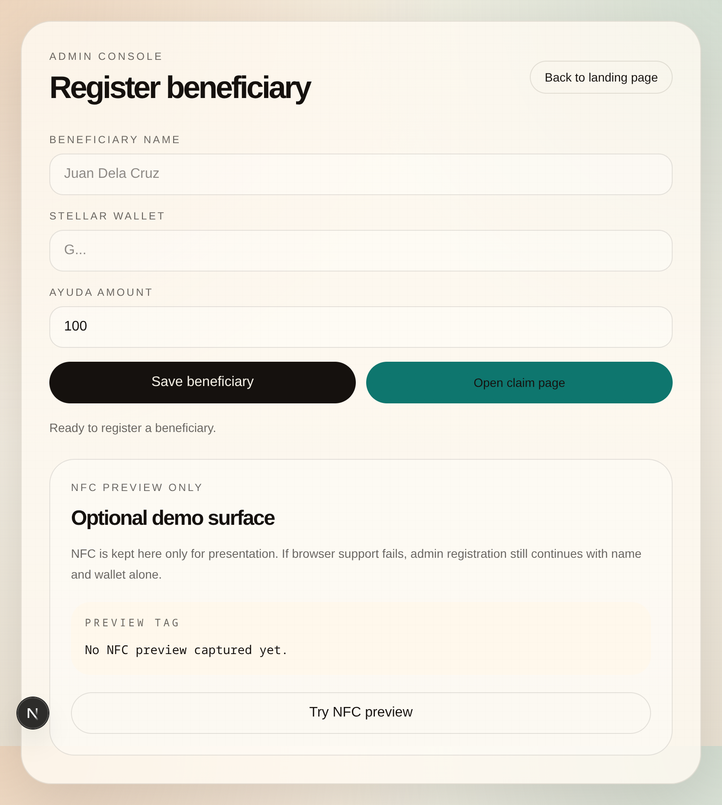
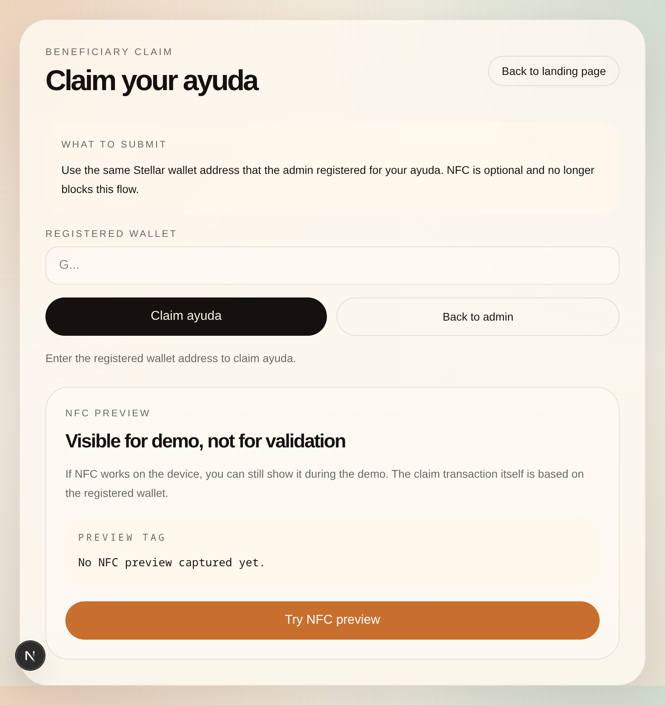

# AYUDA Protocol 🛡️

## 📌 Project Overview

AYUDA Protocol is a decentralized identity and resource distribution system designed for institutional environments.

It solves transparency and accountability issues in aid distribution using NFC-based Proof-of-Presence and blockchain verification.

---

### The Problem

Every day, especially in rural provinces and city centers in the Philippines, oil subsidy drivers and public utility drivers are forced to line up for hours—sometimes half a day—just to claim government fuel subsidies or aid distributions.

These long queues create major inefficiencies:

* Drivers lose valuable working time (income loss for the day)
* Crowded physical claiming centers cause delays and confusion
* Manual verification leads to duplication, errors, and favoritism
* Some eligible drivers are turned away due to incomplete lists or system mismatches
* Lack of transparency makes it unclear who has already received aid
* Manual aid distribution is prone to errors, ghost recipients, and lack of auditing.
* There is no transparency on unclaimed or unverified aid.
* Students struggle with wallets, blockchain complexity, and gas fees.
* Institutions cannot clearly track where funds go after allocation.

As a result, the subsidy meant to support drivers’ livelihood often becomes a burden instead of relief.

---

### The Solution

AYUDA Protocol removes the need for physical lining up by replacing manual distribution with a decentralized, NFC-based and blockchain-verified aid system built on Stellar.

With AYUDA Protocol:

* Each driver is pre-registered and verified as a legitimate beneficiary
* Drivers simply tap an NFC-enabled card or phone to prove presence
* Aid is instantly validated and released through a Soroban smart contract
* NFC cards act as secure physical identity verification.
* Every transaction is recorded on the Stellar blockchain.
* Proof-of-Presence ensures only verified students can claim aid.
* Institutions handle gas fees for a seamless experience.
* Every aid record is fully traceable on-chain.
* If aid remains unclaimed, funds are returned to the institution’s aid pool for future redistribution.
* Every transaction is recorded on-chain for full transparency and auditability
* No physical queues, no manual checking, and no favoritism

Instead of spending hours waiting in line, drivers receive their subsidy in seconds—securely, transparently, and directly to their wallet.

This chat is nearing its limit
Each chat has limited space for messages. Start a new chat to keep responses accurate, or upgrade for increased memory.

---

## 🚀 Key Features

* NFC-based identity verification
* Fully transparent blockchain audit trail
* Real-time admin dashboard
* Instant settlement via Soroban
* Zero gas fees for students
* Institutional aid pool recovery system

--- 

## 🏗 System Evolution & Demo

### 1. Smart Contract Deployment

The foundation of the AYUDA Protocol is deployed on the Stellar Testnet. This confirms that the Soroban smart contract is live, immutable, and publicly verifiable.



---

### 2. Local Protocol Testing

Before deployment, core functions such as `register_citizen`, `fund_aid`, and `claim_aid` were tested locally to ensure correct state handling, prevent duplicate entries, and validate secure aid logic.



---

### 3. On-Chain Verification (Explorer)

Every transaction is fully transparent and can be verified on the Stellar blockchain. This removes the “black box” problem in traditional aid systems.

Contract ID:

```txt
CACB6NY66CGT2YGKBYJGOLSLPHZNYMZ5WBEGSNGYNGFFE7P6QSZYWV6S
```

Explorer:

```txt
https://stellar.expert/explorer/testnet/contract/CACB6NY66CGT2YGKBYJGOLSLPHZNYMZ5WBEGSNGYNGFFE7P6QSZYWV6S
```



---

### 4. Admin Management Dashboard

The admin dashboard connects NFC-based identity verification with blockchain records, allowing real-time monitoring of student registration and aid distribution.






---

## 🛠 Tech Stack

| Layer          | Technology                            |
| -------------- | ------------------------------------- |
| Smart Contract | Rust (Soroban SDK), Stellar Network   |
| Backend        | Rust (Axum), Stellar CLI, Docker      |
| Frontend       | Next.js 14, Tailwind CSS, Web NFC API |
| Infrastructure | Render                                |

---

---

## 📂 Project Structure

```txt
ayuda-protocol/
├── contracts/
│   ├── src/
│   │   ├── lib.rs
│   │   └── test.rs
│   ├── Cargo.toml
├── frontend/
│   ├── src/
│   ├── components/
│   ├── lib/
│   ├── styles/
│   └── package.json
└── README.md
```

---

## 🔧 Smart Contract

```txt
CACB6NY66CGT2YGKBYJGOLSLPHZNYMZ5WBEGSNGYNGFFE7P6QSZYWV6S
```

---

## 🔧 Installation & Setup

```bash
soroban contract build

soroban contract deploy \
  --wasm target/wasm32-unknown-unknown/release/ayuda.wasm \
  --source deployer \
  --network testnet
```

```bash
cd frontend
npm install
npm run dev
```

---


## 🌍 Why Stellar

Stellar enables fast, low-cost, and transparent transactions ideal for institutional aid systems. Soroban smart contracts ensure automation while maintaining full auditability.

---

## 🔮 Future Improvements

* QR fallback for NFC
* SMS notifications
* Multi-campus support
* Advanced analytics dashboard
* Offline NFC syncing

---

## 📜 License

MIT License

